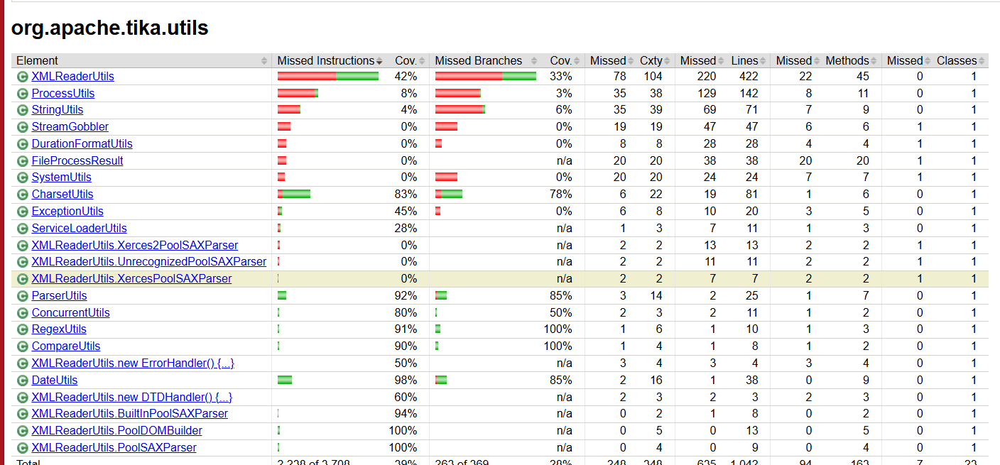

# Brouillon — Rapport Tâche 2

## Informations générales

### Environnement
- Java 17
- Maven Wrapper
- ChatUniTest 2.1.1
- Ollama
- CodeQwen 7B

## Sélection des classes à étudier

### Module sélectionné

Dans le cadre de cette tâche, nous avons choisi de travailler sur le module `tika-core` du projet Apache Tika.
Avant de sélectionner les classes à analyser, nous avons vérifié que le module pouvait être compilé et que ses tests existants pouvaient être exécutés correctement.
La commande suivante a été utilisée depuis la racine du projet :

```bash
./mvnw -pl tika-core -am test
 ```

L'option `-am (also make)` permet également de construire les modules dont tika-core dépend. Cette option était nécessaire puisque l'exécution de tika-core seul ne permettait pas de résoudre la dépendance locale `tika-annotation-processor`.
Le build s'est terminé avec `BUILD SUCCESS`.

### Analyse de la couverture existante

L'énoncé demande de sélectionner entre une et trois classes possédant déjà des tests, mais dont le code n'est pas couvert à 100 %. Nous avons donc commencé par analyser la couverture des tests existants avant d'ajouter de nouveaux tests.
Nous avons utilisé JaCoCo avec la commande :
`./mvnw -pl tika-core -am test jacoco:report`



Pour l'ensemble du module tika-core, le rapport initial indiquait notamment une couverture de 46 % des instructions et de 48 % des branches.
Nous avons ensuite examiné les différents packages et nous nous sommes intéressées au package :
`org.apache.tika.utils`

Celui-ci présentait plusieurs classes avec une couverture inférieure à 100 %, ce qui en faisait un bon point de départ pour rechercher des classes candidates.
Vérification de l'existence de tests
Une couverture inférieure à 100 % n'était pas suffisante pour sélectionner une classe. Nous devions également nous assurer que les classes possédaient déjà des tests.
Nous avons donc recherché les fichiers de test présents dans :
 `tika-core/src/test/java/org/apache/tika/utils`

Les fichiers suivants ont notamment été trouvés :

- `CharsetUtilsTest.java`
- `ConcurrentUtilsTest.java`
- ` RegexUtilsTest.java`
- `ServiceLoaderUtilsTest.java`
- `XMLReaderUtilsTest.java`
Nous avons ensuite croisé ces résultats avec ceux du rapport JaCoCo.

|**Classe**|**Test dédié existant** |**Couverture des instructions**|**Couverture des branches**|
|----------|------------------------|-------------------------------|---------------------------|
|CharsetUtils|Oui|83%|78%|
|ConcurrentUtils|Oui|80%|50%|
|RegexUtils|Oui|91%|100%|
|ServiceLoaderUtils|Oui|100%|100%|
|XMLReaderUtils|Oui|42%|33%|

ServiceLoaderUtils a été écartée puisqu'elle était déjà couverte à 100 % et ne répondait donc pas au critère de sélection.

### Prise en compte de la complexité des classes

Nous avons également pris en compte la taille des classes afin de sélectionner un ensemble suffisamment substantiel pour l'expérimentation, tout en restant raisonnable pour l'analyse détaillée des tests et des mutants.
Nous avons obtenu les tailles suivantes :

|**Classe**|**Nombre de lignes**|
|----------|--------------------|
|CharsetUtils|177|
|ConcurrentUtils|49|
|RegexUtils|57|
|XMLReaderUtils|1201|

XMLReaderUtils présentait une couverture particulièrement faible (42 % des instructions et 33 % des branches), mais comptait environ 1201 lignes. Sa taille était très supérieure à celle des autres candidates et aurait considérablement augmenté la portée de l'expérimentation, notamment lors de l'analyse des mutants et de l'ajout éventuel de tests manuels.
Nous avons donc préféré sélectionner plusieurs classes de taille raisonnable présentant des profils de couverture différents.

### Classes retenues

Les trois classes finalement retenues sont :


1. **CharsetUtils**
2. **ConcurrentUtils**
3. **RegexUtils**

Ces trois classes possèdent donc toutes des tests existants sans atteindre une couverture complète, tout en présentant des niveaux de couverture et des caractéristiques suffisamment différents pour permettre de comparer les résultats de la génération automatique de tests et de l'analyse par mutation.

## CharsetUtils — Molly  (Windows 11)

### ChatUniTest

#### Configuration

ChatUniTest a été configuré dans le module `tika-core` afin de générer des tests à l'aide d'un modèle de langage exécuté localement avec Ollama. Le modèle utilisé est `codeqwen:v1.5-chat`.

Avant la génération, la commande `parse` de ChatUniTest a été exécutée afin d'analyser le projet. L'analyse s'est terminée avec succès et a identifié **361 classes et 1617 méthodes**.

#### Méthodes étudiées

`CharsetUtils` expose trois méthodes publiques principales :

- `isSupported(String charsetName)` : vérifie si un nom de charset est supporté ;
- `clean(String charsetName)` : nettoie et normalise un nom de charset et retourne `null` lorsqu'il n'est pas valide ;
- `forName(String name)` : recherche et retourne le `Charset` correspondant à un nom, en prenant notamment en charge certaines variantes ou erreurs courantes dans les noms de charset.

La génération de tests avec ChatUniTest est effectuée séparément sur ces trois méthodes afin de pouvoir observer et documenter précisément les tests produits, leur capacité à compiler et s'exécuter sans intervention, ainsi que la qualité des oracles générés.

Les méthodes sont étudiées dans l'ordre suivant :

1. `isSupported`
2. `clean`
3. `forName`

#### 1. Génération pour `isSupported`

ChatUniTest a généré un test contenant notamment les trois vérifications suivantes :

```java
assertTrue(CharsetUtils.isSupported("UTF-8"));
assertFalse(CharsetUtils.isSupported("invalid-charset"));
assertFalse(CharsetUtils.isSupported(null));
```

Ces trois cas de test couvrent respectivement :

- un nom de charset valide ( `UTF-8` ) ;
- un nom de charset invalide
- une valeur `null`

Cependant, le test produit par ChatUniTest n'a pas pu être compilé et exécuté directement sans intervention manuelle.

#### Problèmes rencontrés

Le test généré contenait des imports Mockito , notamment :
```java
import org.mockito.*;
import static org.mockito.Mockito.*;
import org.mockito.junit.jupiter.MockitoExtension;
```
Mockito n'est pas une dépendance du module tika-core et ces imports n'étaient pas utilisés par le test. Ils provoquaient donc des erreurs de compilation.
Le test généré contenait également du code utilisant la réflexion sur des éléments internes de CharsetUtils, notamment getCharsetICU. Cette partie reposait sur une interprétation incorrecte de l'implémentation de la classe et produisait notamment un oracle de la forme :

`assertTrue((Boolean) getCharsetICU.invoke(null, "UTF-8"));`

Cette vérification n'était pas valide et dépendait inutilement de détails internes de l'implémentation plutôt que du comportement public de `CharsetUtils`.
ChatUniTest a tenté de corriger automatiquement le test au cours des rounds suivants. Cependant, plusieurs tentatives ont échoué avec une `SocketTimeoutException: Read timed out` . Un appel direct au modèle `codeqwen:v1.5-chat` avec Ollama répondait correctement, ce qui indique que le modèle local était fonctionnel malgré les délais d'attente rencontrés lors des tentatives de correction de ChatUniTest.

#### Corrections manuelles 
Deux catégories principales de corrections fonctionnelles ont été nécessaires pour rendre ce premier test exploitable :
1. suppression des imports Mockito inutiles et indisponibles dans `tika-core` ;
2. suppression des vérifications incorrectes basées sur la réflexion et sur `getCharsetICU`.
Les trois assertions portant directement sur la méthode publique `CharsetUtils.isSupported` ont été conservées.

Le test corrigé a été ajouté dans :

`tika-core/src/test/java/org/apache/tika/utils/CharsetUtilsChatUniTest.java`

Des adaptations de format ont également été nécessaires pour respecter les règles du projet Apache Tika (en-tête de licence Apache, fins de lignes LF et saut de ligne final). Ces adaptations sont considérées séparément des corrections fonctionnelles du test généré.

#### Validation du test corrigé

Le test corrigé à été exécuté avec Maven :
`../mvnw.cmd "-Dtest=CharsetUtilsChatUniTest" test`

Le résultat obtenu est:
`Tests run: 1, Failures: 0, Errors: 0, Skipped: 0  BUILD SUCCESS`

Le test généré pour `isSupported` nécessite donc une intervention manuelle avant de pouvoir être intégré au projet, mais les cas de test pertinents proposés par le modèle ont pu être conservés et exécutés avec succès après correction.

#### 2. Génération pour `clean`

ChatUniTest a ensuite été exécuté sur la méthode `clean`. Plusieurs tests ont été générés, mais aucun n'a compilé directement. Les deux premières générations ont échoué pendant les cinq rounds de correction automatique. Lors de la troisième génération, les rounds 0 à 3 ont également échoué à la compilation et le round 4 s'est terminé par une `SocketTimeoutException`.

L'analyse du test généré au round 0 montre que ChatUniTest proposait trois cas :

```java
assertEquals("UTF-8", CharsetUtils.clean("UTF-8"));
assertEquals(null, CharsetUtils.clean("invalid"));
assertEquals(null, CharsetUtils.clean(null));
```

Ces trois oracles sont cohérents avec l'implémentation de `clean` : un charset valide est normalisé, tandis qu'une entrée invalide ou `null` conduit à une `IllegalArgumentException` interceptée par `clean` , qui retourne alors `null`.

L'échec de compilation provenait des imports Mockito ajoutés automatiquement par ChatUniTest :

```package org.mockito does not exist
package org.mockito.junit.jupiter does not exist
```
Mockito n'est pas utilisé par les tests générés et n'est pas une dépendance de tika-core. Malgré plusieurs rounds de correction, ChatUniTest n'a pas supprimé ces imports automatiquement.

**Correction manuelle effectuée** : suppression des imports Mockito inutiles. Les cas de test et leurs oracles ont été conservés sans modification logique.

Après intégration dans  `CharsetUtilsChatUniTest.java` , les tests ont été exécutés avec Maven :

`Tests run: 4, Failures: 0, Errors: 0, Skipped: 0 BUILD SUCCESS`

Ce résultat comprend le test précédent de `isSupported` et les trois tests générés pour `clean`.

#### 3. Génération pour `forName`

ChatUniTest a généré des tests pour la méthode forName(String) en utilisant le modèle local CodeQwen via Ollama.

La génération automatique a rencontré plusieurs échecs de compilation et des erreurs de délai d'attente (SocketTimeoutException). Le test généré a été récupéré dans les fichiers temporaires de ChatUniTest.

**Corrections manuelles:**

1. Suppression des imports Mockito inutiles , responsables d'erreurs de compilation .
2. Correction de l'oracle pour null : la méthode lève `IllegalArgumentException`.
3. Correction de l'oracle pour cp850 : le nom canonique retourné est IBM850 et non cp850.

Les sept cas générés ont été conservés dans une seule méthode JUnit , `testForName()` .
**Validation** : après correction, les cinq méthodes de test de CharsetUtilsChatUniTest ont été exécutées avec Maven : `5 tests, 0 échec, 0 erreur BUILLD SUCCESS` .


### Oracles
Nous avons comparé les oracles générés par ChatUniTest avec ceux des tests originaux de `CharsetUtilsTest.java` , selon trois critères : **pertinence, précision et capacité à détecter des défauts** .

#### 1. Pertinence des oracles 

Les oracles générés sont globalement pertinents, puisqu'ils vérifient des comportements attendus des trois méthodes publiques de CharsetUtils.

Cependant, plusieurs scénarios sont redondants avec les tests originaux :

-  **isSupported()** : les vérifications de UTF-8, d'un charset inexistant et de null sont déjà représentées dans les tests existants.

-  **clean()** : ChatUniTest vérifie principalement un charset valide, un charset invalide et null. Les tests originaux couvrent également les espaces, les guillemets, les alias et les formats inhabituels.

-  **forName()** : ChatUniTest apporte des assertions directes sur cette méthode, qui était auparavant testée indirectement par les appels à `clean()` .

isSupported() : les vérifications de UTF-8, d'un charset inexistant et de null sont déjà représentées dans les tests existants.

clean() : ChatUniTest vérifie principalement un charset valide, un charset invalide et null. Les tests originaux couvrent également les espaces, les guillemets, les alias et les formats inhabituels.

forName() : ChatUniTest apporte des assertions directes sur cette méthode, qui était auparavant testée indirectement par les appels à clean().

Les oracles générés sont donc pertinents, mais apportent relativement peu de nouveaux scénarios.

#### 2. Précision et validité des oracles 

Les oracles originaux sont généralement plus précis : ils vérifient les résultats exacts de la normalisation, notamment la conversion d'alias en noms canoniques.

ChatUniTest a toutefois généré deux oracles incorrects pour `forName()` :

- **Entrée null** : l'IA attendait IllegalCharsetNameException, alors que la méthode lève IllegalArgumentException.

- **Entrée "cp850"** : l'IA attendait "cp850", alors que Charset.name() retourne le nom canonique "IBM850".

Ces deux erreurs montrent qu'un test généré peut sembler logique tout en reposant sur une mauvaise interprétation du comportement du programme.

Les oracles ont donc dû être vérifiés à partir du code source et des résultats d'exécution avant leur intégration.

#### 3. Capacité à détecter des défauts

Les tests originaux possèdent des oracles plus diversifiés, notamment pour les règles de normalisation et les cas limites. Ils sont donc susceptibles de détecter davantage de défauts liés à ces comportements.

Les tests générés se concentrent davantage sur les cas courants et reproduisent plusieurs assertions déjà existantes. Néanmoins, les assertions directes sur forName() pourraient permettre de détecter certains défauts supplémentaires.

Cette contribution ne peut pas être confirmée par la simple réussite des tests : elle devra être évaluée à l'aide des scores de mutation obtenus avec PIT.

**En conclusion** , ChatUniTest produit des oracles majoritairement pertinents, mais parfois redondants ou incorrects. Les tests originaux se distinguent par leur diversité et leur précision, particulièrement pour les cas limites et les règles de normalisation.


### PIT
...

### Tests manuels
...

## ConcurrentUtils — Cyreanne  (MacOS)

### ChatUniTest
...

### Oracles
...

### PIT
...

### Tests manuels
...

## RegexUtils — Cyreanne  (MacOS)

### ChatUniTest
...

### Oracles
...

### PIT
...

### Tests manuels
...

## Comparaison et conclusion
...
